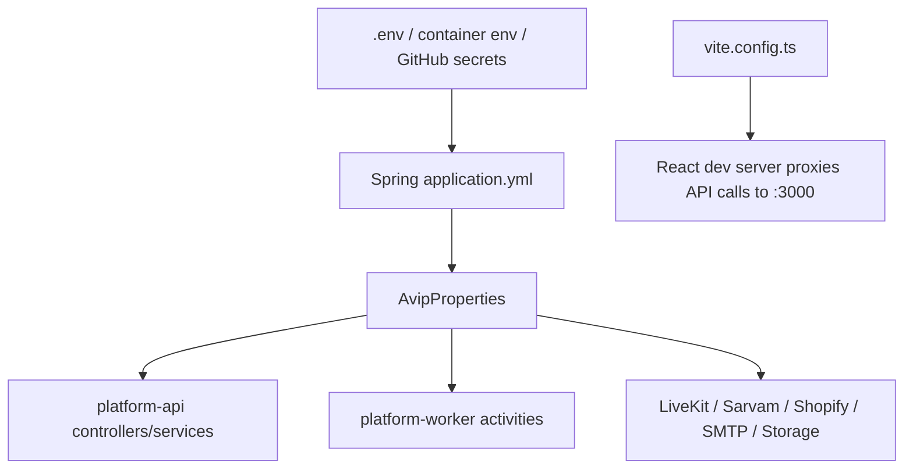
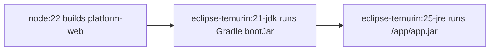
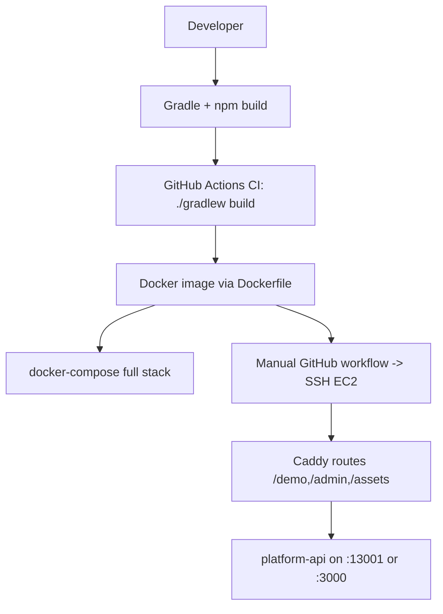
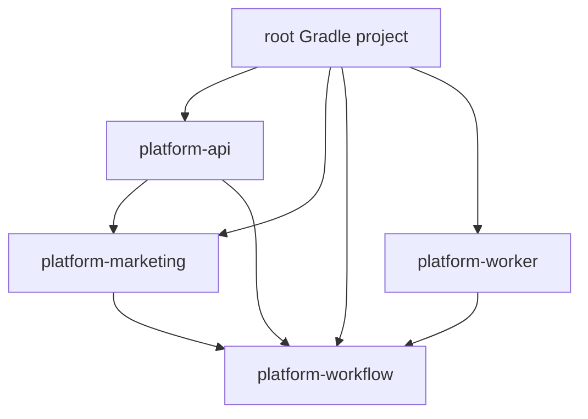
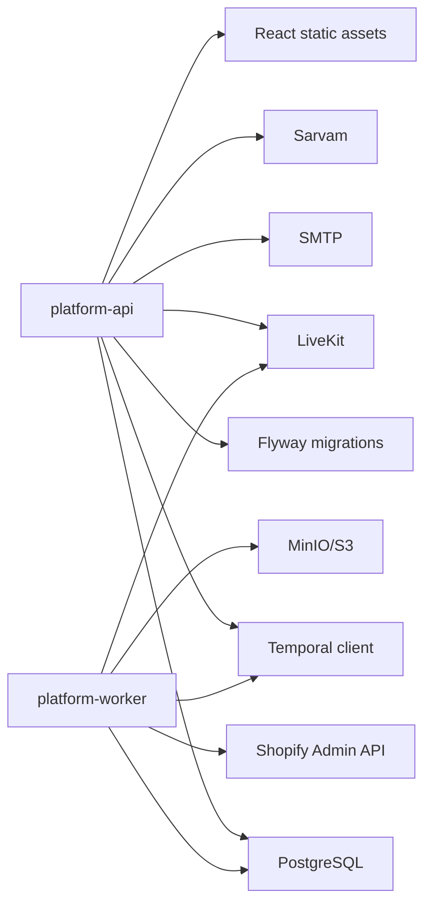
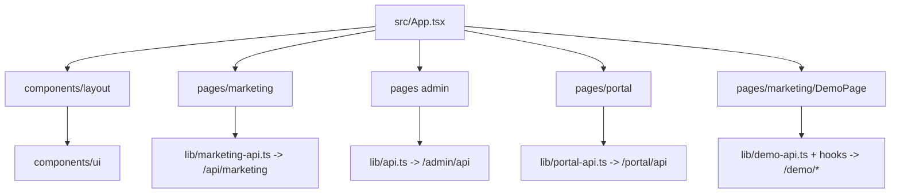
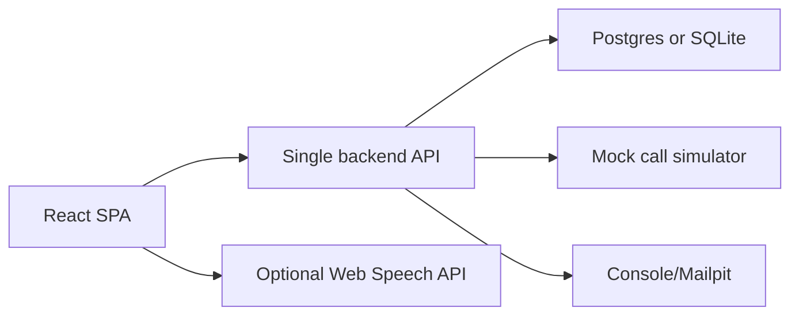
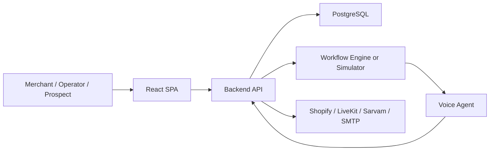
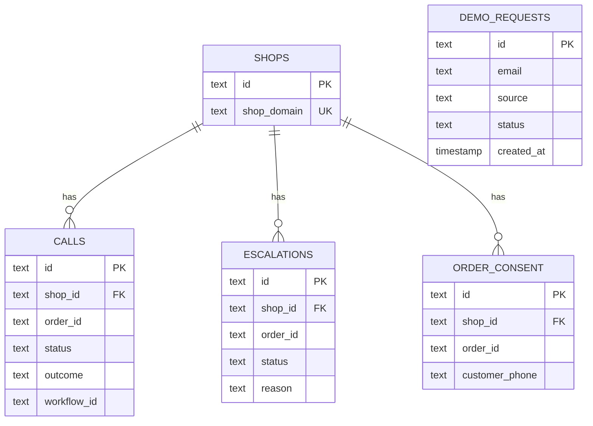
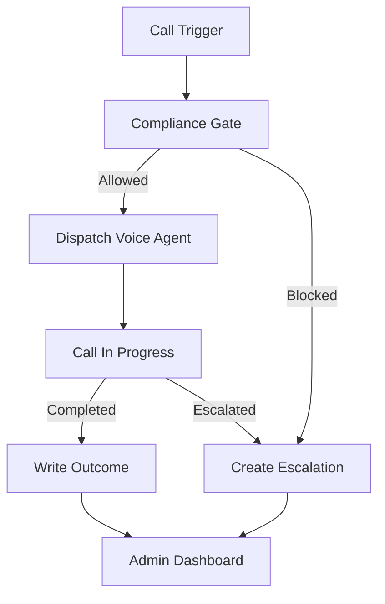

# AVIP Rebuild Notes: Phases 11-17

This document continues the reverse-engineering rebuild guide for `avip-platform`. Conclusions are cited to repository files. Where the repository does not expose enough information, this document states: "Cannot be determined from the repository."

## Source Files Used

Primary files used for this phase:

- Root build/deploy: `README.md`, `.env.example`, `.env.staging-demo.example`, `settings.gradle.kts`, `build.gradle.kts`, `gradle/libs.versions.toml`, `Dockerfile`, `Taskfile.yml`
- Backend config/security: `platform-api/src/main/resources/application.yml`, `platform-worker/src/main/resources/application.yml`, `platform-api/src/main/kotlin/com/vedanova/platform/api/config/SecurityConfig.kt`, `platform-workflow/src/main/kotlin/com/vedanova/platform/config/AvipProperties.kt`, `platform-workflow/src/main/kotlin/com/vedanova/platform/config/TemporalConfiguration.kt`
- Backend auth/services: `AdminAuthService.kt`, `PortalAuthService.kt`, `PortalLoginService.kt`, `VoiceDemoTokenService.kt`, `ShopInternalService.kt`, `CallTriggerService.kt`
- Workflows/integrations: `CallLifecycleWorkflowImpl.kt`, `AvipActivitiesImpl.kt`, `LiveKitTelephonyAdapter.kt`, `TelephonyAdapter.kt`, `ShopifyRegistry.kt`, `SarvamDemoClient.kt`
- Frontend config: `platform-web/package.json`, `platform-web/vite.config.ts`, `platform-web/components.json`, `platform-web/src/App.tsx`
- Deploy: `deploy/README.md`, `deploy/compose/docker-compose.yml`, `deploy/compose/staging-demo.yml`, `deploy/STAGING_DEMO.md`, `deploy/STAGING_CUTOVER.md`, `.github/workflows/ci.yml`, `.github/workflows/staging-demo-deploy.yml`, `scripts/dev.sh`, `scripts/staging-demo/deploy-on-host.sh`
- Database/API details from previous phases: Flyway SQL migrations and controllers/repositories under `platform-api` and `platform-workflow`

## Phase 11 - Configuration

### Configuration Model

Runtime configuration is centralized under Spring Boot property prefix `avip`, mapped by `AvipProperties` in `platform-workflow/src/main/kotlin/com/vedanova/platform/config/AvipProperties.kt`. The API and worker each load YAML defaults from:

- `platform-api/src/main/resources/application.yml`
- `platform-worker/src/main/resources/application.yml`

The frontend dev server configuration is in `platform-web/vite.config.ts`. Docker/runtime values are supplied through `.env`, `.env.staging-demo`, and Docker Compose.

### Environment Variables

| Variable | Purpose | Default / Notes | Cited Files |
|---|---|---|---|
| `PORT` | API HTTP port | `3000` | `platform-api/src/main/resources/application.yml` |
| `DATABASE_URL` | JDBC URL | local `jdbc:postgresql://localhost:5433/avip`; compose uses `postgres:5432/avip` | `.env.example`, `application.yml`, `docker-compose.yml` |
| `DATABASE_USERNAME` | DB username | `postgres` | `.env.example`, `application.yml` |
| `DATABASE_PASSWORD` | DB password | `postgres` local | `.env.example`, `docker-compose.yml` |
| `TEMPORAL_ADDRESS` | Temporal gRPC address | `localhost:7233` | `.env.example`, `TemporalConfiguration.kt` |
| `TEMPORAL_NAMESPACE` | Temporal namespace | `default` | `.env.example`, `AvipProperties.kt` |
| `TEMPORAL_TASK_QUEUE` | Worker task queue | `avip-main` | `.env.example`, `TemporalWorkerRunner.kt` |
| `APP_URL` | Public app URL used in emails | local examples use `http://localhost:3000` or Vite URL fallback | `.env.example`, `PortalMailService.kt`, `VoiceDemoMailService.kt` |
| `AVIP_INTERNAL_SIGNAL_SECRET` | Shared secret for `/internal/*` | dev default present, must be changed | `.env.example`, `SecurityConfig.kt` |
| `AVIP_ADMIN_USERNAME` | Admin username | `admin` | `.env.example`, `AdminAuthService.kt` |
| `AVIP_ADMIN_PASSWORD` | Admin password | `admin` in dev example; blank disables login in service logic | `.env.example`, `AdminAuthService.kt` |
| `AVIP_ADMIN_SESSION_SECRET` | HMAC secret for admin tokens | fallback to internal secret | `application.yml`, `AdminAuthService.kt` |
| `AVIP_ADMIN_SESSION_TTL_HOURS` | Admin token TTL | `24` | `application.yml`, `AvipProperties.kt` |
| `SIMULATION_MODE_ENABLED` / `AVIP_SIMULATION_ENABLED` | Enables simulation mode | default true in API config | `application.yml` |
| `AVIP_DEV_STORE` / `SHOPIFY_SHOP_DOMAIN` | Dev shop domain | sample Shopify domain | `.env.example`, `application.yml` |
| `DEFAULT_LANGUAGE` | Default call language | `hi-IN` | `.env.example`, `AvipProperties.kt` |
| `LIVEKIT_URL` | Browser WebRTC URL | must be `wss://...` for real demo | `.env.example`, `DemoLiveKitService.kt` |
| `LIVEKIT_API_URL` | Server SDK HTTP URL | can be derived from `LIVEKIT_URL` | `.env.example`, `AvipProperties.kt` |
| `LIVEKIT_API_KEY` | LiveKit API key | secret | `.env.example`, LiveKit adapter files |
| `LIVEKIT_API_SECRET` | LiveKit API secret | secret | `.env.example`, LiveKit adapter files |
| `LIVEKIT_AGENT_NAME` | Agent worker name | `avip-recovery-agent` | `.env.example`, `DemoLiveKitService.kt` |
| `LIVEKIT_SIP_OUTBOUND_TRUNK_ID` | LiveKit SIP trunk | required for PSTN dialing | `.env.example`, `TelephonyAdapter.kt` |
| `LIVEKIT_SIP_WAIT_UNTIL_ANSWERED` | SIP option | `false` | `application.yml`, `AvipProperties.kt` |
| `SARVAM_API_KEY` | Sarvam STT/TTS key | secret | `.env.example`, `SarvamDemoClient.kt` |
| `SARVAM_TTS_SPEAKER` | TTS voice speaker | `priya` | `.env.example`, `SarvamDemoClient.kt` |
| `TELEPHONY_PROVIDER` | Telephony mode | `vobiz`; also supports `noop`/`stub` | `application.yml`, `TelephonyAdapter.kt` |
| `MINIO_ENDPOINT` | S3/MinIO endpoint | local `http://localhost:9000` | `.env.example`, `docker-compose.yml` |
| `MINIO_ACCESS_KEY` | Storage key | local `minio` | `.env.example` |
| `MINIO_SECRET_KEY` | Storage secret | local `minio123` | `.env.example` |
| `MINIO_BUCKET` | Recording bucket | `avip-recordings` | `.env.example`, `RecordingStorage.kt` |
| `MINIO_REGION` | Storage region | `us-east-1` | `.env.example`, `AvipProperties.kt` |
| `SMTP_HOST` | Mail host | local `localhost`/compose `mailpit` | `.env.example`, `docker-compose.yml` |
| `SMTP_PORT` | Mail port | `1025` local | `.env.example`, `application.yml` |
| `AVIP_MAIL_ENABLED` | Mail feature flag | `true`; staging may disable it | `.env.example`, `STAGING_DEMO.md` |
| `AVIP_MAIL_FROM` | Email sender | `AVIP <noreply@avip.local>` | `.env.example`, mail services |
| `AVIP_VOICE_DEMO_GATE_ENABLED` | Require demo magic links | `true`; staging demo may disable if no SMTP | `application.yml`, `STAGING_DEMO.md` |
| `AVIP_VOICE_DEMO_TOKEN_TTL_HOURS` | Demo link TTL | `72` | `application.yml`, `AvipProperties.kt` |
| `AVIP_VOICE_DEMO_TOKEN_SECRET` | Demo token HMAC secret | fallback chain to admin/internal secret | `application.yml`, `VoiceDemoTokenService.kt` |
| `AVIP_DEMO_TRANSCRIPT_LOG_ENABLED` | Store demo transcripts | `true` | `application.yml`, `DemoTranscriptLogService.kt` |
| `AVIP_DEMO_TRANSCRIPT_LOG_DIR` | Transcript file directory | `data/demo-transcripts` | `.env.example`, `DemoTranscriptLogService.kt` |
| `AVIP_PORTAL_LOGIN_TOKEN_TTL_MINUTES` | Portal magic link TTL | `30` | `application.yml`, `AvipProperties.kt` |
| `AVIP_PORTAL_SESSION_TTL_HOURS` | Portal cookie session TTL | `168` | `application.yml`, `PortalAuthService.kt` |
| `AVIP_PORTAL_SESSION_SECRET` | Portal session HMAC secret | fallback chain to admin/internal secret | `application.yml`, `PortalAuthService.kt` |
| `SHOPIFY_API_KEY` | Shopify app key | present in env example but not used by OAuth code in this repo | `.env.example` |
| `SHOPIFY_API_SECRET` | Shopify app secret / encryption fallback | used as fallback for token encryption key | `.env.example`, `application.yml` |
| `SHOPIFY_API_VERSION` | Shopify Admin API version | `2024-10` | `.env.example`, `ShopifyRegistry.kt` |
| `TOKEN_ENCRYPTION_KEY` | Encrypt Shopify access tokens | fallback to `SHOPIFY_API_SECRET` | `.env.example`, `ShopInternalService.kt` |

### Secrets

Must be treated as secrets:

- DB password
- `AVIP_INTERNAL_SIGNAL_SECRET`
- Admin password and session secret
- Portal/demo token secrets
- LiveKit API key/secret and SIP trunk id
- Sarvam API key
- MinIO/S3 access/secret keys
- Shopify access tokens, API secret, token encryption key
- SMTP credentials if used, though username/password fields are not shown in repo YAML
- SSH deploy secrets in GitHub Actions: `STAGING_HOST`, `STAGING_SSH_KEY`, `STAGING_SSH_USER` from `.github/workflows/staging-demo-deploy.yml`

Secrets management beyond `.env`, GitHub Actions secrets, and generated staging env files cannot be determined from the repository.

### Configuration Files

| File | Purpose |
|---|---|
| `.env.example` | Main local/full-stack environment template |
| `.env.staging-demo.example` | Staging voice-demo-only environment template |
| `platform-api/src/main/resources/application.yml` | API defaults, DB, Flyway, mail, app properties |
| `platform-worker/src/main/resources/application.yml` | Worker defaults, DB, Temporal, LiveKit, telephony |
| `platform-web/vite.config.ts` | Frontend build and local proxy config |
| `platform-web/components.json` | shadcn-style UI aliases/registry/icons |
| `deploy/compose/docker-compose.yml` | Full local stack |
| `deploy/compose/staging-demo.yml` | Minimal staging demo stack |
| `deploy/temporal/dynamicconfig/development-sql.yaml` | Temporal dynamic config |
| `Taskfile.yml` | Developer commands for build/test/dev/up/down |

### Feature Flags / Runtime Switches

| Flag | Effect | File Evidence |
|---|---|---|
| `AVIP_VOICE_DEMO_GATE_ENABLED` | Requires demo magic link before `/demo` APIs | `DemoController.kt`, `AvipProperties.kt` |
| `AVIP_DEMO_TRANSCRIPT_LOG_ENABLED` | Enables/disables transcript persistence | `DemoTranscriptLogService.kt` |
| `AVIP_MAIL_ENABLED` | Sends real mail or logs links | `PortalMailService.kt`, `VoiceDemoMailService.kt` |
| `SIMULATION_MODE_ENABLED` / `AVIP_SIMULATION_ENABLED` | Enables simulation behavior | `application.yml`; exact enforcement outside seen code is limited |
| `TELEPHONY_PROVIDER=noop/stub` | Skips real outbound PSTN dialing | `TelephonyAdapter.kt` |
| `-PskipWebBuild` | Skips frontend build during Gradle resource processing | `platform-api/build.gradle.kts`, `Dockerfile` |

### Runtime Configuration Flow



## Phase 12 - Security

### Authentication

| Area | Mechanism | Files |
|---|---|---|
| Internal APIs `/internal/*` | Shared secret header `x-avip-internal-secret` | `SecurityConfig.kt` |
| Admin APIs `/admin/api/*` | HMAC bearer token after env username/password login | `AdminAuthService.kt`, `SecurityConfig.kt` |
| Portal APIs `/portal/api/*` | Magic link login, then HMAC HttpOnly cookie | `PortalLoginService.kt`, `PortalAuthService.kt`, `PortalController.kt` |
| Demo APIs `/demo/*` | HMAC magic-link token and HttpOnly cookie/header/Bearer | `VoiceDemoTokenService.kt`, `DemoController.kt` |
| Shopify Admin API | Stored encrypted access token or env fallback | `ShopifyRegistry.kt`, `ShopInternalService.kt` |
| LiveKit browser access | LiveKit JWT room token | `DemoLiveKitService.kt` |

### Authorization

- Internal authorization is binary: correct shared secret grants all `/internal/*`.
- Admin authorization is binary: valid admin token grants all `/admin/api/*`.
- Portal authorization checks session validity and exposes `role`, but fine-grained role enforcement cannot be determined from the repository.
- Identity schema supports account memberships and roles, but no per-route role matrix is implemented in visible code.

### JWT

- LiveKit uses JWT generated by LiveKit SDK for room join grants in `DemoLiveKitService.kt`.
- Admin, portal, and demo tokens are not JWTs. They are custom Base64 URL payload plus HMAC signature strings.

### OAuth

- Shopify OAuth callback or installation flow is not implemented in this repository.
- `/internal/shops/upsert` accepts `shopDomain`, `accessToken`, and `scopes` from a separate `avip-shopify` app.
- Therefore Shopify OAuth details cannot be determined from the repository.

### Cookies and Sessions

| Cookie | Purpose | Attributes | Files |
|---|---|---|---|
| `avip_demo_token` | Demo access token | `Path=/; Max-Age=...; HttpOnly; SameSite=Lax` | `DemoController.kt`, `AvipProperties.kt` |
| `avip_portal_session` | Portal session | `Path=/; Max-Age=...; HttpOnly; SameSite=Lax` | `PortalAuthService.kt`, `AvipProperties.kt` |

Cookie `Secure` is not set in current code. In HTTPS production this should be added.

### Encryption

- Shopify access tokens are encrypted using `TokenEncryption` before storage; service requires `TOKEN_ENCRYPTION_KEY` or `SHOPIFY_API_SECRET` fallback. Evidence: `ShopInternalService.kt`, `ShopifyRegistry.kt`.
- Admin/portal/demo tokens use HMAC SHA-256 signatures, not encryption.
- Portal magic-link raw token is stored only as SHA-256 hash in DB via `PortalTokenHasher.kt`.
- Demo magic-link token is not stored hashed; it is self-contained and signed. DB stores the demo request.

### Validation

Implemented examples:

- Email validation is simple: non-empty and contains `@`.
- Shop domain/order ID/prompt required checks in internal services/controllers.
- Limits are capped in repositories (`limit.coerceIn`).
- Demo WAV size must be >= 44 bytes and <= 5 MB.
- Demo transcript requires `id` and `roomName`.
- Workflow ID is validated as non-blank on signal endpoints.

Validation limitations:

- Email validation is minimal.
- Phone validation is minimal and mostly normalized for Indian +91 in `TelephonyAdapter.kt`.
- No request schema validation library is used broadly except `@Valid` and `@NotBlank` on signal DTOs.

### Rate Limiting

No rate limiting middleware, gateway config, or per-IP throttle is present. Cannot be determined from the repository beyond saying it is not implemented here.

### CSRF

- Portal and demo use cookies, but state-changing endpoints are same-site and no CSRF token mechanism is visible.
- `SameSite=Lax` helps but is not a complete CSRF strategy for all flows.
- No Spring Security CSRF module is configured; custom filters are used.

### XSS

- React escapes text by default.
- No explicit Content Security Policy is configured.
- Transcript/demo/lead data is rendered by frontend; sanitization beyond React defaults cannot be determined from the repository.

### CORS

- No explicit API CORS filter/config is visible.
- Local frontend development uses Vite proxy instead of CORS, per `platform-web/vite.config.ts`.
- Temporal UI CORS origins are configured for Temporal UI only in `docker-compose.yml`.

### Secrets Management

- Local: `.env`.
- Compose: `env_file`.
- GitHub Actions staging deploy: GitHub Secrets for SSH.
- Staging deploy script generates `.env.staging-demo` with `chmod 600`.
- No cloud secret manager is configured in this repository.

### Potential Vulnerabilities / Risks

| Risk | Severity | Evidence | Suggested Fix |
|---|---:|---|---|
| Dev defaults include weak admin/internal secrets | High | `.env.example`, `application.yml` defaults | Fail startup in non-dev if defaults are used |
| Internal shared secret grants broad access | High | `SecurityConfig.kt` | Use per-client API keys, scopes, rotation, audit |
| No rate limiting on login/demo invite endpoints | High | No rate limit config found | Add gateway or server-side rate limiting |
| Admin token stored in browser storage likely exposed to XSS | Medium | `platform-web/src/lib/api.ts`, auth helper usage | Prefer HttpOnly cookie admin session plus CSP |
| Portal/demo cookies lack `Secure` attribute | Medium | `PortalAuthService.kt`, `DemoController.kt` | Add `Secure` when `APP_URL` is HTTPS |
| CSRF protection absent for cookie-auth portal/demo endpoints | Medium | Custom filters, no CSRF token | Add CSRF token or strict SameSite+origin checks |
| Minimal email validation | Low/Medium | service checks only `contains('@')` | Use robust email validation |
| No CSP/security headers visible | Medium | no header config found | Add CSP, HSTS, X-Content-Type-Options |
| Demo gate can be disabled in staging | Medium | `STAGING_DEMO.md`, deploy script | Never disable for public environments |
| Shopify OAuth not in repo; token upsert trusts caller | High if exposed | `/internal/shops/upsert` | Keep endpoint private; validate HMAC/app signature in Shopify app |
| Recording storage only stores object key | Low | `RecordingStorage.kt` | Implement signed upload/access and retention controls |

## Phase 13 - Build & Deployment

### Build Process

Backend:

1. Root Gradle multi-module project includes `platform-api`, `platform-marketing`, `platform-workflow`, `platform-worker` via `settings.gradle.kts`.
2. Shared version catalog is in `gradle/libs.versions.toml`.
3. Root `build.gradle.kts` configures Kotlin JVM, Spring dependency management, JDK 25 toolchain, JUnit Platform.
4. `platform-api/build.gradle.kts` depends on `platform-marketing` and `platform-workflow`.
5. `platform-worker/build.gradle.kts` depends on `platform-workflow`.

Frontend:

1. `platform-web/package.json` uses `npm install`, `npm run build`.
2. Vite builds React/TypeScript/Tailwind assets into `platform-web/dist`.
3. Gradle task `copyPlatformWeb` copies `dist` into generated API static resources.
4. `processResources` includes generated static files unless `-PskipWebBuild` is passed.

Build commands from `Taskfile.yml`:

- `task build` -> `./gradlew build`
- `task test` -> `./gradlew test`
- `task web:build` -> `./gradlew :platform-api:copyPlatformWeb`

### Docker

`Dockerfile` is a multi-stage build:



Important behavior:

- Build arg `MODULE` controls whether image builds `platform-api` or `platform-worker`.
- Frontend is built once in the `web` stage and copied into API static resources.
- Gradle runs `:${MODULE}:bootJar -x test -PskipWebBuild`.
- Runtime exposes `3000` and runs as `nobody`.

### Docker Compose

Full local stack from `deploy/compose/docker-compose.yml`:

- `postgres`
- `temporal`
- `temporal-ui`
- `minio`
- `mailpit`
- `platform-api`
- `platform-worker`

Minimal staging-demo stack from `deploy/compose/staging-demo.yml`:

- `postgres`
- `platform-api`

The staging demo intentionally excludes Temporal, worker, MinIO, Shopify app, and PSTN flows; this is stated in `deploy/STAGING_DEMO.md`.

### CI/CD

CI:

- `.github/workflows/ci.yml`
- Runs on push/PR to `main`.
- Sets up Temurin JDK 21 for Gradle runtime.
- Runs `./gradlew build`.

Staging demo deploy:

- `.github/workflows/staging-demo-deploy.yml`
- Manual `workflow_dispatch`.
- Copies `scripts/staging-demo/deploy-on-host.sh` to EC2 via SCP.
- Runs deploy script via SSH.
- Uses GitHub secrets `STAGING_HOST`, `STAGING_SSH_USER`, `STAGING_SSH_KEY`.

### Hosting / Cloud Services

Can be inferred:

- Staging target is EC2, per `deploy/STAGING_DEMO.md` and SSH workflow.
- Caddy is used as host reverse proxy for demo routes, per `deploy/ec2/caddy-demo-routes.snippet`.
- LiveKit and Sarvam are external hosted APIs.
- Mail can be SES/SendGrid for staging, according to `deploy/STAGING_DEMO.md`.

Cannot be determined from the repository:

- Production cloud provider beyond staging EC2.
- Production database hosting.
- Production secret manager.
- Production observability provider.
- Domain/DNS ownership except example `sslip.io`.
- Backup/restore strategy.

### Deployment Pipeline



## Phase 14 - Dependency Graph

### Backend Module Dependencies



### Backend Runtime Dependencies



### Frontend Dependency Graph



### Shared Library / Package Dependencies

| Area | Dependencies | Source |
|---|---|---|
| Frontend app | React, React DOM, React Router, LiveKit client, Tailwind, Radix/Base UI, shadcn utilities, Framer Motion, Lucide/Tabler | `platform-web/package.json` |
| API | Spring WebMVC, Actuator, JDBC, Validation, Mail, Flyway, PostgreSQL, Springdoc, Kotlin reflect | `platform-api/build.gradle.kts` |
| Workflow shared | Spring context/JDBC, Temporal SDK, LiveKit server SDK, Jackson Kotlin modules | `platform-workflow/build.gradle.kts` |
| Worker | Spring Boot, JDBC, PostgreSQL, Temporal SDK | `platform-worker/build.gradle.kts` |
| Marketing backend | Spring WebMVC, LiveKit server SDK, Jackson | `platform-marketing/build.gradle.kts` |

## Phase 15 - Hackathon MVP

### Product Goal for 24-48 Hours

Demo a Shopify RTO recovery platform where an operator can trigger a simulated customer recovery call, see the call lifecycle, and show a browser voice demo. The MVP should prove the workflow and UX, not full production telephony/compliance.

### Core Features Only

Keep:

1. Marketing landing + request demo form.
2. Admin login.
3. Admin dashboard with shops/calls/escalations.
4. Internal trigger call endpoint.
5. Simulated call workflow.
6. Demo voice room or mocked voice interaction.
7. Basic compliance consent check.
8. Minimal database schema.

Skip or defer:

- Real Shopify OAuth.
- Full Shopify Admin writeback.
- PSTN dialing.
- MinIO recording upload.
- Customer portal.
- Scheduled calls.
- Full audit/analytics.
- Production-grade RBAC.
- Staging Caddy automation.

Mock:

- Shopify orders with static JSON/fake order context.
- LiveKit agent completion by a button or timed background task.
- Sarvam STT/TTS with browser speech APIs or text input.
- Email magic links by showing the link in admin/dev console.
- Storage by storing recording URL/object key as a string.

### External APIs to Replace

| Original | Fast Replacement |
|---|---|
| Shopify Admin API | Hardcoded fake order repository |
| LiveKit SIP/PSTN | Noop dialer + browser demo |
| Sarvam STT/TTS | Browser Web Speech API, text input, or mock audio |
| SMTP | Console log links or Mailpit only |
| MinIO | Local string field; no object storage |
| Temporal | For fastest MVP, use simple DB state machine; for closer architecture, keep Temporal |

### Open-Source / Cheaper Alternatives

- Database: SQLite for single-process hackathon, PostgreSQL if using Docker.
- Workflow: In-memory job queue or DB status transitions instead of Temporal.
- Voice demo: Web Speech API or LiveKit free tier.
- Email: Mailpit locally or Resend/SendGrid free tier.
- UI: React + Tailwind + shadcn components.
- Backend: Kotlin/Spring if team knows it; otherwise Node/NestJS or FastAPI for speed.

### Fastest Architecture



### Recommended Hackathon Stack

If preserving repo DNA:

- React + Vite + Tailwind
- Kotlin + Spring Boot
- PostgreSQL
- Docker Compose
- Optional Temporal only if team already knows it

If optimizing purely for speed:

- React + Vite + Tailwind + shadcn
- Node.js/NestJS or FastAPI
- SQLite/PostgreSQL
- Prisma/SQLAlchemy for quick data access
- Browser speech/text mock
- Docker Compose only for DB

### Minimal Infrastructure

- One web/API container or one API plus static frontend.
- One Postgres database.
- No Temporal initially.
- No MinIO.
- No separate worker.
- No Caddy until final hosting.
- Deploy to Render/Fly.io/Railway or a single EC2 with Docker.

## Phase 16 - Rebuild Plan

### Day 1 - Product Skeleton and Data

Goals:

- Create repo, app shell, DB schema, and core APIs.

Tasks:

1. Scaffold React/Vite frontend with routes: `/`, `/request-demo`, `/demo`, `/admin`, `/admin/calls`, `/admin/escalations`.
2. Scaffold backend API with health endpoint.
3. Create DB tables: `shops`, `calls`, `escalations`, `demo_requests`, `order_consent`, `users/admin_sessions` if needed.
4. Implement admin login with simple env password.
5. Implement request demo form and demo request storage.
6. Implement fake shop seed and fake order context.
7. Implement call trigger endpoint.
8. Implement call simulator:
   - `dispatching`
   - `in_call`
   - after delay -> `completed` or `escalated`
9. Build admin dashboard reading calls/escalations.

Deliverable:

- Admin can log in, trigger/view fake calls, and see metrics.

### Day 2 - Voice Demo and Workflow Polish

Goals:

- Make the demo feel like the real product.

Tasks:

1. Implement `/demo` page with text/voice-like interaction.
2. Add magic-link-lite access:
   - Request access
   - Show/log link
   - Exchange link for cookie/session
3. Add compliance:
   - Consent required
   - DND list optional
   - NDR attempt count block at third attempt
4. Add fake Shopify order detail display.
5. Add transcript capture/logging.
6. Add manual completion/escalation signal endpoint or admin buttons.
7. Improve admin views:
   - Calls table
   - Escalations table
   - Demo requests table
8. Package with Docker Compose.

Deliverable:

- End-to-end demo: lead -> demo access -> call trigger -> simulated customer conversation -> outcome in dashboard.

### Day 3 - Integration Optionality and Demo Readiness

Goals:

- Add one real integration if time allows and polish final demo.

Options:

1. Add LiveKit room creation if keys are ready.
2. Add SMTP/Mailpit magic links.
3. Add Temporal if architecture fidelity matters.
4. Add Shopify Admin API read-only order fetch if test shop token is ready.

Polish tasks:

1. Seed demo data.
2. Add loading/error/empty states.
3. Add environment docs.
4. Add deployment config.
5. Record a happy-path script.
6. Smoke test from clean checkout.

### Testing

Minimum tests:

- API health.
- Admin login success/failure.
- Demo request validation.
- Call trigger validation.
- Call lifecycle state transition.
- Compliance blocks.
- Dashboard metrics.

Manual QA script:

1. Start stack.
2. Open landing page.
3. Submit demo request.
4. Log in as admin.
5. Trigger simulated call.
6. Confirm call appears as `dispatching` then `in_call` then `completed`.
7. Trigger escalation case.
8. Confirm escalation appears and can be resolved.
9. Open demo page using magic link.

### Deployment

Fast path:

1. Build frontend.
2. Serve static frontend from backend.
3. Use Docker image for API.
4. Use managed Postgres or Docker Postgres.
5. Deploy to a single host.

Production-like path:

1. API container.
2. Worker container.
3. Postgres.
4. Temporal.
5. Reverse proxy TLS.
6. Mail provider.
7. LiveKit/Sarvam keys.

### Final Demo Story

1. "A Shopify merchant has failed delivery orders."
2. Show admin dashboard with open recovery workload.
3. Trigger recovery for a fake order.
4. Show compliance check.
5. Show simulated/real voice agent interaction.
6. Show completed outcome and transcript.
7. Show escalation path.
8. Show prospect voice demo and request flow.

## Phase 17 - Documentation Pack

The following sections are ready to copy into separate docs for a new team.

### Architecture Documentation



Key architecture decisions from original repo:

- Monorepo with separate API, worker, workflow shared module, marketing/demo backend, and React SPA.
- REST APIs grouped by audience: marketing, demo, admin, portal, internal, signal.
- Durable call lifecycle via Temporal.
- SQL-first persistence with JDBC repositories, not ORM.
- Static frontend bundled into API jar for production.

### Tech Stack Document

Original stack:

| Layer | Technology |
|---|---|
| Frontend | React, TypeScript, Vite, Tailwind, Radix/Base UI, LiveKit client |
| API | Kotlin, Spring Boot, Spring WebMVC |
| Persistence | PostgreSQL, Flyway, Spring JDBC |
| Workflow | Temporal |
| Worker | Kotlin Spring Boot process |
| Voice | LiveKit rooms/agent dispatch/SIP |
| Demo AI speech | Sarvam STT/TTS |
| Commerce | Shopify Admin API |
| Email | SMTP/Mailpit |
| Storage | MinIO/S3-compatible object storage |
| Build | Gradle, npm |
| Deploy | Docker, Docker Compose, GitHub Actions, EC2/Caddy staging |

MVP stack recommendation is in Phase 15.

### API Documentation

Use the API inventory from `docs/REBUILD_PHASES_5_10.md`, Phase 8. For implementation, group controllers as:

- Public marketing: `/api/marketing/*`
- Public gated demo: `/demo/*`
- Admin: `/admin/api/*`
- Portal: `/portal/api/*`
- Internal Shopify/app: `/internal/*`
- Internal voice-agent signals: `/internal/signals/*`
- Health/docs: `/health`, `/openapi.json`, `/swagger-ui`

Authentication requirements:

- Public: none.
- Demo: HMAC token/cookie when gate enabled.
- Admin: Bearer HMAC token.
- Portal: HttpOnly cookie.
- Internal: `x-avip-internal-secret`.

### Module Documentation

| Module | Responsibility | Rebuild Notes |
|---|---|---|
| `platform-web` | Browser UI for marketing, demo, admin, portal | Build as one SPA; keep API clients separate by audience |
| `platform-api` | Main REST API and static resource host | Owns controllers, Flyway, API services, admin/portal/internal auth |
| `platform-marketing` | Demo-specific backend controller/services | Can merge into API for MVP |
| `platform-workflow` | Domain contracts, workflows, activities, repositories, integrations | In MVP, split into `domain` + `services`, or keep as shared module |
| `platform-worker` | Temporal worker runtime | Skip initially if using simple simulator |

### Integration Document

| Integration | MVP Plan | Production Plan |
|---|---|---|
| Shopify | Fake order JSON | OAuth app, store encrypted access token, Admin API read/write |
| LiveKit | Optional browser room only | Agent dispatch + SIP outbound |
| Sarvam | Mock or browser speech | Server-side STT/TTS proxy |
| SMTP | Console/Mailpit links | SES/SendGrid/SMTP provider |
| Temporal | Skip or use if familiar | Durable workflow worker |
| MinIO/S3 | Skip | Upload/store recordings and signed access |

### Database Documentation

Minimum MVP tables:



Full original ERD is in `docs/REBUILD_PHASES_5_10.md`, Phase 7.

### Development Guide

Original local setup:

1. Copy `.env.example` to `.env`.
2. Fill LiveKit/Sarvam/secrets if using real demo.
3. Run `task up` for full compose stack.
4. Run `task dev` for infra + API/worker + Vite.
5. Run `task test` for Gradle tests.
6. Open:
   - Marketing: `http://127.0.0.1:5173/` in dev or `:3000` static API
   - Admin: `/admin`
   - Demo: `/demo`
   - Mailpit: `:8025`
   - Temporal UI: `:8080`

If rebuilding MVP:

1. Use `.env.local`.
2. Seed DB with one shop and several fake orders.
3. Run frontend and backend locally.
4. Provide `docker compose up` for DB.
5. Keep all external integrations optional behind env flags.

### README Draft

```markdown
# AVIP MVP

AI-assisted RTO recovery dashboard for Shopify merchants.

## Features

- Marketing request-demo flow
- Admin dashboard
- Simulated recovery call lifecycle
- Compliance consent check
- Escalation queue
- Optional browser voice demo

## Quick Start

cp .env.example .env
docker compose up -d db
npm install
npm run dev

## Demo Flow

1. Log in at /admin
2. Trigger a simulated recovery call
3. Watch call status transition
4. Complete or escalate the call
5. Review dashboard metrics
```

### High Level Design (HLD)

Responsibilities:

- Frontend renders public pages, demo page, admin console, portal.
- API validates/authenticates requests and maps them to services.
- Database stores shops, calls, escalations, compliance, leads, identity.
- Workflow engine or simulator runs long call state transitions.
- Voice/AI layer receives order context and returns outcome.
- External integrations enrich/complete the flow.

HLD flow:



### Low Level Design (LLD)

Suggested services for rebuild:

| Service/Class | Methods | Responsibility |
|---|---|---|
| `AuthService` | `loginAdmin`, `validateAdminToken` | Admin auth |
| `DemoAccessService` | `requestAccess`, `grantAccess`, `validateDemo` | Demo links/cookies |
| `ShopService` | `upsertShop`, `getShop`, `ensureDemoShop` | Shop records |
| `CallService` | `triggerCall`, `listCalls`, `updateStatus` | Call API/business orchestration |
| `CallLifecycleRunner` | `run(input)`, `complete`, `escalate` | Workflow/simulator |
| `ComplianceService` | `recordConsent`, `checkDial` | Consent/DND/NDR rules |
| `EscalationService` | `create`, `resolve`, `list` | Human queue |
| `DemoRequestService` | `create`, `list` | Lead capture |
| `IntegrationShopifyClient` | `getOrder`, `writeAttempt` | Replaceable Shopify adapter |
| `VoiceProvider` | `dispatch`, `dial`, `createDemoSession` | Replaceable LiveKit/mock adapter |

LLD call lifecycle pseudocode:

```text
triggerCall(shopDomain, orderId):
  shop = requireShop(shopDomain)
  input = buildCallLifecycleInput(shop, orderId, overrides)
  workflowId = workflow.start(input)
  return workflowId

runLifecycle(input):
  config = loadShopConfig(input.shopId)
  order = simulation ? fakeOrder(input.orderId) : shopify.getOrder(...)
  effective = applyOverrides(config, order, input.overrides)
  dispatch = voice.dispatchAgent(effective)
  calls.upsertDispatching(...)
  compliance = compliance.checkDial(...)
  if not allowed:
    escalations.create(...)
    calls.updateStatus(escalated)
    return
  voice.dial(...)
  wait for completion/escalation/timeout
  if completed:
    shopify.writeAttempt(...)
    calls.updateStatus(completed)
  if escalated:
    escalations.create(...)
    calls.updateStatus(escalated)
```

## Explicit Unknowns

- The full production Shopify OAuth app is not in this repository.
- The actual conversational AI agent implementation is not in this repository.
- The LLM provider/model used by the external agent cannot be determined from this repository. Staging docs mention OpenRouter keys for the separate agent, but this platform repo does not call OpenRouter directly.
- Production cloud infrastructure, secret manager, backups, monitoring, alerting, and domain setup cannot be determined from this repository.
- Billing/Stripe behavior cannot be determined from the repository; schema has `stripe_customer_id`, but no Stripe integration code is present.
