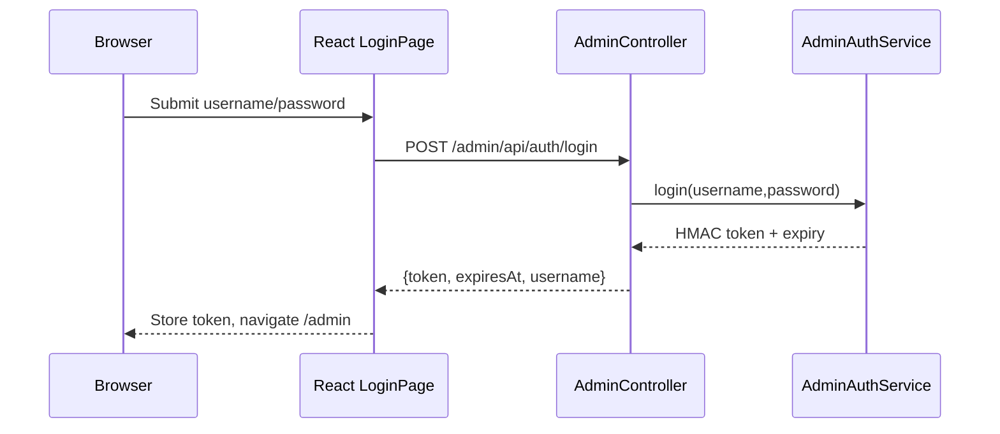
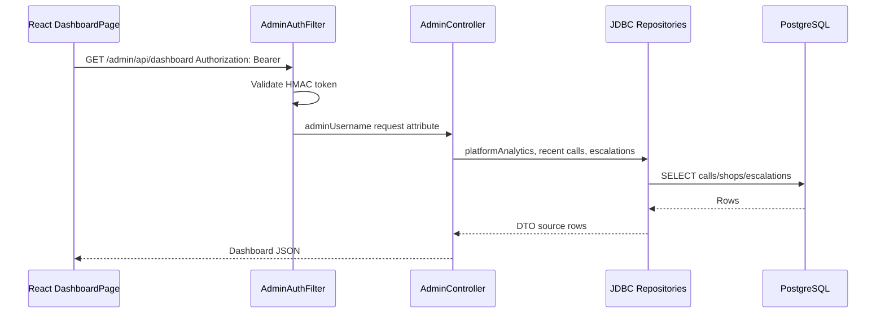
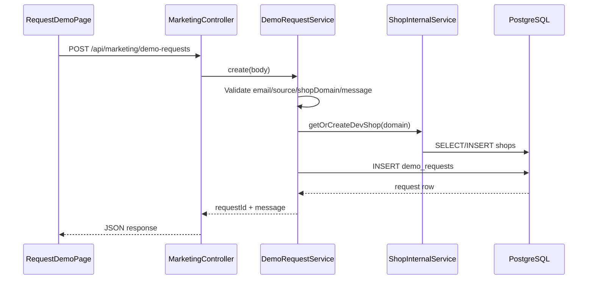
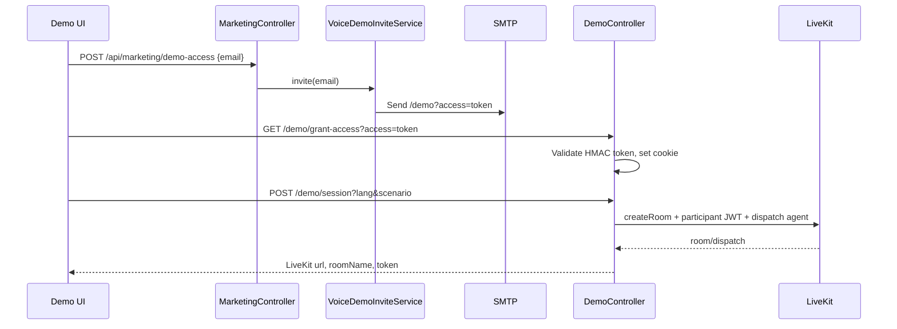
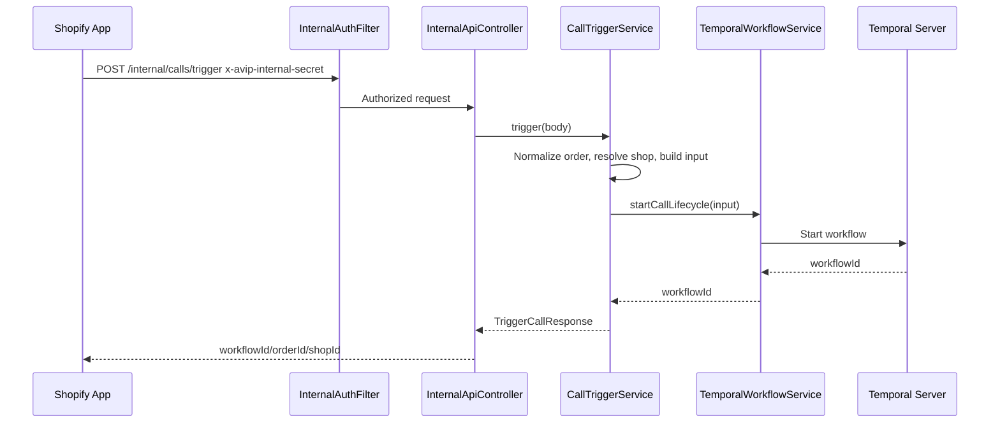
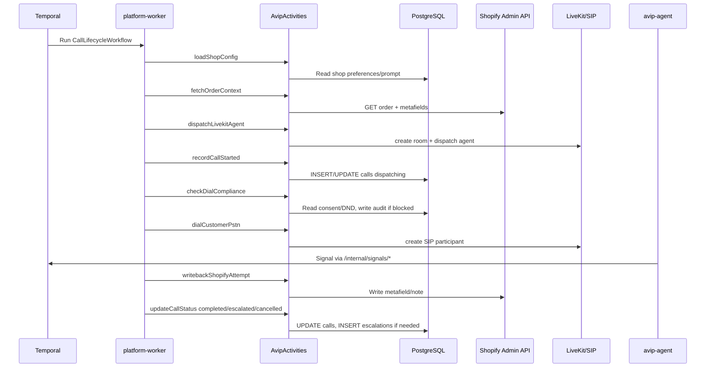
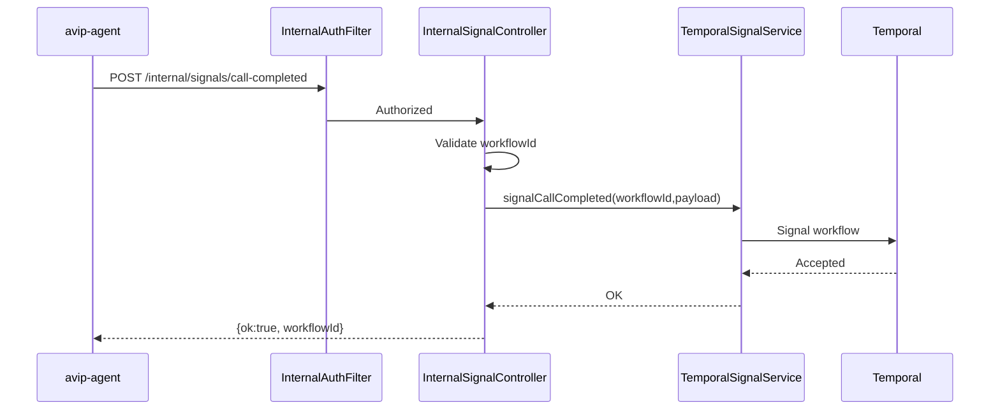
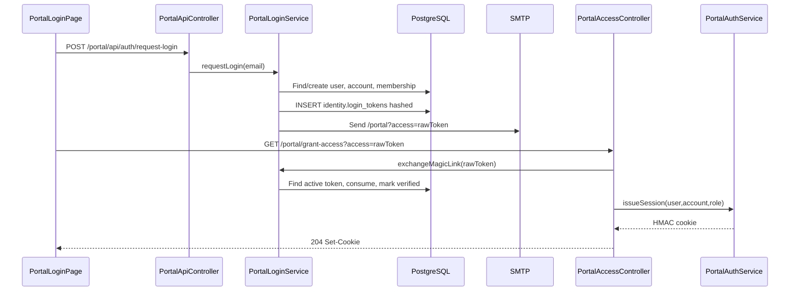
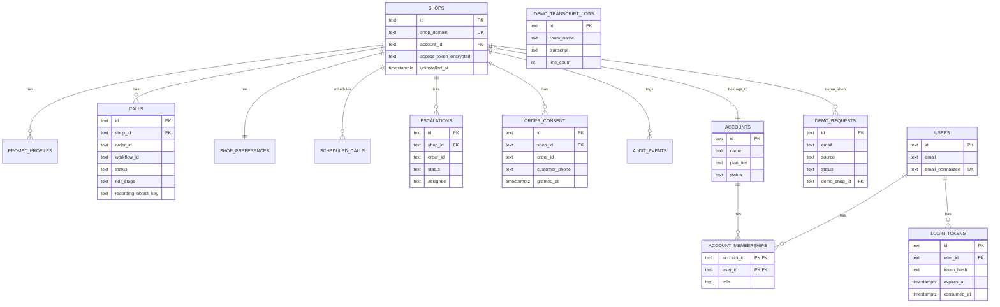

# AVIP Rebuild Notes: Phases 5-10

This document reverse engineers the implementation surface needed to rebuild `avip-platform` for a hackathon. It focuses on product features, request flows, database design, APIs, integrations, and AI/voice architecture.

## Phase 5 - Feature Breakdown

### 1. Public Marketing Site

- Purpose: Explain AVIP, collect prospect interest, route prospects to demo/install/legal pages.
- Files involved: `platform-web/src/pages/marketing/*`, `platform-web/src/components/marketing/*`, `platform-web/src/content/*`, `platform-web/src/components/layout/MarketingLayout.tsx`, `platform-api/src/main/kotlin/com/vedanova/platform/api/controller/MarketingController.kt`.
- Frontend flow: Browser loads `/`, `/request-demo`, `/install`, `/compliance`, `/privacy`, `/terms`; React Router renders marketing layout and page components.
- Backend flow: Static SPA is served by `platform-api`; form submissions hit `/api/marketing/demo-requests` or `/api/marketing/demo-access`.
- Database interactions: Inserts into `demo_requests`; may create/ensure a demo `shops` row for a supplied shop domain.
- External APIs: SMTP for demo access emails.
- Business logic: Normalize shop domain, validate lead source, create request record, optionally create demo shop.
- Validation: Email must contain `@`; `book-demo` requires `shopDomain`; `contact` requires `message`.
- Error handling: `400` for invalid input/source, `500` for failed shop setup or persistence.
- Dependencies: React, Vite, Spring MVC, JDBC, mail.

### 2. Voice Demo Access / Magic Link

- Purpose: Gate the live voice demo behind short-lived email links.
- Files involved: `MarketingController.kt`, `VoiceDemoInviteService.kt`, `VoiceDemoMailService.kt`, `VoiceDemoTokenService.kt`, `DemoController.kt`, `platform-web/src/lib/demo-api.ts`, `DemoAccessGuard.tsx`.
- Frontend flow: User requests access; receives email; opens `/demo?access=token`; frontend exchanges token with `/demo/grant-access`; then checks `/demo/access-status`.
- Backend flow: Marketing API issues HMAC token; demo controller validates token and sets HttpOnly cookie.
- Database interactions: Inserts lead/invite into `demo_requests`.
- External APIs: SMTP/Mailpit.
- Business logic: Token payload is `requestId|email|expiresAt`, signed with HMAC SHA-256; TTL from `AVIP_VOICE_DEMO_TOKEN_TTL_HOURS`.
- Validation: Valid email; allowed invite source: `demo-access` or `admin-invite`; valid, unexpired token.
- Error handling: `400` missing token, `401` invalid/expired token, mail failures are logged but invite can still succeed.
- Dependencies: HMAC, Base64 URL encoding, Spring Mail.

### 3. Browser Voice Demo Session

- Purpose: Let prospects talk to the AVIP voice agent in a LiveKit room.
- Files involved: `DemoPage.tsx`, `useVoiceDemo.ts`, `useDemoPipeline.ts`, `DemoLivePanel.tsx`, `DemoControlDock.tsx`, `DemoController.kt`, `DemoLiveKitService.kt`.
- Frontend flow: Demo page starts session via `/demo/session`; receives LiveKit URL, room, participant token; connects with `livekit-client`; user speaks or holds-to-talk.
- Backend flow: Creates LiveKit room, creates participant JWT, dispatches configured agent with demo metadata.
- Database interactions: None during session creation.
- External APIs: LiveKit room service and agent dispatch service.
- Business logic: Demo room name `avip-demo-*`; participant `demo-user-*`; metadata includes source `avip-demo`, simulation mode, language, scenario.
- Validation: Demo access required unless gate disabled; LiveKit credentials required.
- Error handling: `412` if LiveKit missing; `502` if room creation/dispatch fails; dispatch failure can return `dispatchOk=false` with hint.
- Dependencies: LiveKit server SDK, LiveKit browser client.

### 4. Demo TTS / STT / Transcript Logging

- Purpose: Support demo audio synthesis, transcription, and transcript retention.
- Files involved: `DemoController.kt`, `SarvamDemoClient.kt`, `DemoTranscriptLogService.kt`, `DemoTranscriptLogRepository`, `demo-api.ts`, demo hooks.
- Frontend flow: Browser sends text to `/demo/tts`, WAV bytes to `/demo/transcribe`, and transcript lines to `/demo/transcript-log`.
- Backend flow: Validates demo access; proxies TTS/STT to Sarvam; logs transcripts to Postgres and optionally local files.
- Database interactions: Upserts `demo_transcript_logs`.
- External APIs: Sarvam `speech-to-text`, Sarvam `text-to-speech`.
- Business logic: STT model `saaras:v3`; TTS model `bulbul:v3`; default speaker `priya`; transcript file path grouped by UTC date.
- Validation: TTS text required; WAV must be at least 44 bytes and max 5 MB; transcript requires `id` and `roomName`, non-empty lines.
- Error handling: `400` empty TTS/audio/transcript ids; `401` demo access missing; `412` Sarvam key missing; `413` audio too large; `502` upstream Sarvam failure.
- Dependencies: Sarvam API key, Jackson, filesystem write access for transcript logs.

### 5. Admin Authentication

- Purpose: Protect operator console.
- Files involved: `LoginPage.tsx`, `AuthGuard.tsx`, `platform-web/src/lib/auth.ts`, `platform-web/src/lib/api.ts`, `AdminController.kt`, `AdminAuthService.kt`, `SecurityConfig.kt`.
- Frontend flow: Admin submits username/password to `/admin/api/auth/login`; token stored client-side; subsequent requests use `Authorization: Bearer`.
- Backend flow: Validates credentials from env; issues HMAC token; filter validates token for `/admin/api/*`.
- Database interactions: None.
- External APIs: None.
- Business logic: Token payload `username|expiresAt`, HMAC SHA-256 signed by admin/session secret.
- Validation: Username/password exact match; token signature and expiry.
- Error handling: `401` invalid credentials/token; `503` if admin password disabled/blank.
- Dependencies: HMAC, env config.

### 6. Admin Dashboard / Shops / Calls / Escalations / Demo Invites

- Purpose: Operator visibility and demo invite management.
- Files involved: `DashboardPage.tsx`, `ShopsPage.tsx`, `CallsPage.tsx`, `EscalationsPage.tsx`, `DemoInvitesPage.tsx`, `AdminController.kt`, repositories in `Repositories.kt`.
- Frontend flow: Admin pages call `/admin/api/dashboard`, `/shops`, `/calls`, `/escalations`, `/demo-requests`, `/demo-invites`.
- Backend flow: Admin auth filter injects username; controller reads repositories and maps rows to DTOs.
- Database interactions: Reads `shops`, `calls`, `escalations`, `demo_requests`; inserts demo invite request.
- External APIs: SMTP for admin-triggered demo invite.
- Business logic: Analytics count total calls, calls this month, completed calls, open escalations, average duration, recovery rate.
- Validation: Limit query params are capped to 1-200; invite email must be valid.
- Error handling: Auth `401`; bad email `400`; mail failures logged.
- Dependencies: JDBC repositories, mail.

### 7. Internal Shopify App Backchannel

- Purpose: Allow the separately deployed Shopify app to register shops, configure shops, record consent, list state, and trigger calls.
- Files involved: `InternalApiController.kt`, `ShopInternalService.kt`, `CallTriggerService.kt`, `PreferencesRepository`, `PromptRepository`, `ComplianceRepository`, `SecurityConfig.kt`.
- Frontend flow: Not browser-facing; called by `avip-shopify`.
- Backend flow: `x-avip-internal-secret` filter gates all `/internal/*`; controller dispatches to services/repositories.
- Database interactions: Upsert/read `shops`, `shop_preferences`, `prompt_profiles`, `calls`, `escalations`, `compliance.order_consent`.
- External APIs: Temporal for call trigger; future Shopify webhook registration is logged as deferred.
- Business logic: Encrypt Shopify access token; normalize order ID; force new workflow for custom recovery; default language `hi-IN`.
- Validation: Required shop domain, access token, order ID, non-empty prompt.
- Error handling: `401` bad internal secret; `400` missing inputs; `404` shop missing; `500` persistence/Temporal failures.
- Dependencies: HMAC-independent shared secret, token encryption, Temporal client.

### 8. Call Trigger + Temporal Call Lifecycle

- Purpose: Start and run the actual AI recovery call.
- Files involved: `CallTriggerService.kt`, `TemporalWorkflowService.kt`, `CallLifecycleWorkflow.kt`, `CallLifecycleWorkflowImpl.kt`, `AvipActivities.kt`, `AvipActivitiesImpl.kt`, `TemporalWorkerRunner.kt`.
- Frontend flow: Usually initiated by Shopify/internal app; admin/dev may use simulation endpoint.
- Backend flow: API starts Temporal workflow with deterministic workflow ID; worker executes workflow activities.
- Database interactions: Upserts `calls`, updates call status, NDR stage, recording object key; creates `escalations`; reads preferences/prompt/shop config.
- External APIs: Temporal, Shopify Admin API, LiveKit, LiveKit SIP, MinIO/S3-style storage metadata.
- Business logic: Load shop config; fetch Shopify order unless simulation; apply overrides; dispatch agent; check compliance; dial PSTN; wait 30 minutes for completion/escalation; write back Shopify attempt; update final status.
- Validation: Shop/order required; LiveKit/SIP config required for real calls; compliance must allow dial.
- Error handling: Temporal start failure -> `500`; workflow timeout -> call `cancelled`; compliance failure -> call `escalated`; missing LiveKit/SIP config throws activity failure and retries.
- Dependencies: Temporal task queue `avip-main`, LiveKit, Shopify credentials, compliance tables.

### 9. Internal Agent Signals

- Purpose: Let the external voice worker report call completion or human escalation back to the workflow.
- Files involved: `InternalSignalController.kt`, `TemporalSignalService.kt`, `CallLifecycleWorkflowImpl.kt`.
- Frontend flow: Not browser-facing; called by `avip-agent`.
- Backend flow: Internal secret filter; controller validates workflow ID; service sends Temporal signal.
- Database interactions: Indirect through workflow after signal.
- External APIs: Temporal signal API.
- Business logic: `callCompleted` stores payload for final writeback; `escalateToHuman` sets escalation flag/reason.
- Validation: Non-blank `workflowId`.
- Error handling: `400` blank workflow ID; `401` bad secret; Temporal signal errors bubble as server errors.
- Dependencies: Temporal client.

### 10. Compliance and Audit

- Purpose: Prevent invalid AI calls and record why calls were blocked.
- Files involved: `ComplianceService.kt`, `NdrStage.kt`, `ComplianceRepositories.kt`, `InternalApiController.kt`.
- Frontend flow: Shopify app records and checks consent through internal endpoints.
- Backend flow: Compliance service evaluates NDR stage, DND list, and consent before dialing.
- Database interactions: `compliance.order_consent`, `compliance.dnd_numbers`, `audit.events`, `calls.ndr_stage`.
- External APIs: None.
- Business logic: AI dial is blocked at NDR-3, blocked for DND numbers, blocked without checkout consent.
- Validation: Shop domain/order ID required; consent source defaults to `checkout`.
- Error handling: Compliance block creates escalation and returns workflow result `blocked:{orderId}`; endpoint failures return `400`, `404`, or `500`.
- Dependencies: PostgreSQL JSONB for audit payloads.

### 11. Shopify Integration and Writeback

- Purpose: Read order/customer context and write RTO attempt results back to Shopify.
- Files involved: `ShopifyRegistry.kt`, `ShopifyWriteback.kt`, `CallWritebackService.kt`, `ShopInternalService.kt`.
- Frontend flow: Not direct.
- Backend flow: Worker decrypts stored shop token; fetches order; maps customer/order/address/attempts; writes metafield and note after call completion.
- Database interactions: Reads `shops.access_token_encrypted`.
- External APIs: Shopify Admin REST API.
- Business logic: Uses order metafield namespace `rto`, key `attempts`; note includes reason, language, duration, transcript excerpt.
- Validation: Access token must exist from shop install or `SHOPIFY_ACCESS_TOKEN`; order ID normalized after last slash.
- Error handling: Non-2xx Shopify response throws activity exception and Temporal retry applies.
- Dependencies: Java HTTP client, Jackson, token encryption.

### 12. Customer Portal Authentication and Dashboard

- Purpose: Foundation for merchant account portal.
- Files involved: `PortalLoginPage.tsx`, `PortalDashboardPage.tsx`, `PortalAuthGuard.tsx`, `portal-api.ts`, `PortalController.kt`, `PortalLoginService.kt`, `PortalAuthService.kt`, `AccountProvisioningService.kt`, `IdentityRepository.kt`.
- Frontend flow: User requests login link; opens `/portal?access=token`; frontend exchanges token at `/portal/grant-access`; HttpOnly cookie authenticates `/portal/api/*`.
- Backend flow: Provision account/user/membership if missing; create hashed login token; email link; exchange consumes token and issues session cookie.
- Database interactions: `identity.accounts`, `identity.users`, `identity.account_memberships`, `identity.login_tokens`, `shops.account_id`.
- External APIs: SMTP.
- Business logic: Existing user returns primary owner account; new user gets new trial account and owner membership.
- Validation: Email must contain `@`; login token must exist, be unconsumed, and unexpired.
- Error handling: `400` invalid email/token; `401` invalid/expired session; `403` no membership; mail failures logged.
- Dependencies: SHA-256 token hashing, HMAC session cookies.

### 13. Dev Simulation

- Purpose: Trigger a simulated RTO call against a dev shop without Shopify order lookup.
- Files involved: `DevController.kt`, `SimulateRtoService.kt`, `Simulation.kt`, `CallTriggerService.kt`.
- Frontend flow: Developer/operator posts to `/dev/simulate-rto`.
- Backend flow: Creates/uses dev shop domain and starts workflow with simulation mode.
- Database interactions: Ensures dev `shops` row and call rows as workflow runs.
- External APIs: Temporal and LiveKit; skips Shopify fetch and PSTN dial inside workflow when simulation mode is true.
- Business logic: Fake order context is generated by `Simulation.fakeOrderContext`.
- Validation: Depends on trigger request defaults.
- Error handling: Trigger/Temporal failures return server errors.
- Dependencies: Simulation mode config.

### 14. Health, Swagger, SPA Fallback

- Purpose: Operability and frontend hosting.
- Files involved: `HealthController.kt`, `SpaController.kt`, `application.yml`, `platform-api/build.gradle.kts`.
- Frontend flow: Browser routes are handled by React after static fallback.
- Backend flow: `/health` returns basic status; Springdoc exposes `/openapi.json` and `/swagger-ui`.
- Database interactions: None for health controller.
- External APIs: None.
- Business logic: API jar includes built `platform-web/dist` as static resources.
- Validation/Error handling: Standard Spring handling.
- Dependencies: Spring Actuator/Springdoc/static resources.

## Phase 6 - Request Flow

### Admin Login

### Admin Dashboard

### Marketing Demo Request

### Demo Access + Demo Session

### Trigger Recovery Call

### Temporal Call Lifecycle

### Agent Completion Signal

### Portal Login

## Phase 7 - Database Analysis

### Entities and Rules

| Entity | Primary Key | Important Fields | Business Rules |
|---|---|---|---|
| `shops` | `id` | `shop_domain`, `account_id`, `access_token_encrypted`, `scopes`, `uninstalled_at` | Active shop means `uninstalled_at IS NULL`; `shop_domain` unique; access token encrypted |
| `prompt_profiles` | `id` | `shop_id`, `system_prompt`, `is_default` | One default profile is assumed per shop by code, though DB does not enforce partial uniqueness |
| `calls` | `id` | `shop_id`, `order_id`, `workflow_id`, `room_name`, `status`, `outcome`, `ndr_stage`, `recording_object_key` | Unique `(shop_id, order_id)`; status lifecycle: pending/dispatching/in_call/completed/escalated/cancelled |
| `shop_preferences` | `shop_id` | `default_language`, `auto_webhook`, `escalation_email_enabled` | Defaults to `hi-IN`, webhook enabled, escalation email enabled |
| `scheduled_calls` | `id` | `shop_id`, `order_id`, `start_at`, `status` | Schema exists; no scheduler implementation found |
| `escalations` | `id` | `shop_id`, `order_id`, `call_id`, `reason`, `status`, `assignee` | Open/resolved status; resolving only updates open rows |
| `compliance.order_consent` | `id` | `shop_id`, `order_id`, `customer_phone`, `consent_source`, `granted_at` | Unique `(shop_id, order_id)`; required before AI dial |
| `compliance.dnd_numbers` | `phone_e164` | `reason`, `created_at` | Presence blocks dial |
| `audit.events` | `id` | `shop_id`, `event_type`, `payload` | Logs compliance block reasons |
| `demo_requests` | `id` | `email`, `source`, `status`, `demo_shop_id` | Sources include `book-demo`, `contact`, `demo-access`, `admin-invite`; source validation differs by service |
| `identity.accounts` | `id` | `name`, `billing_email`, `stripe_customer_id`, `plan_tier`, `status` | Defaults to trial; Stripe field exists but no Stripe integration implemented |
| `identity.users` | `id` | `email`, `email_normalized`, `full_name`, `email_verified_at`, `auth_provider` | `email_normalized` unique |
| `identity.account_memberships` | `(account_id,user_id)` | `role`, `invited_at`, `accepted_at` | Role used in session but not deeply authorized |
| `identity.operator_users` | `id` | `email`, `password_hash`, `role`, `disabled_at` | Schema exists; current admin auth uses env credentials instead |
| `identity.login_tokens` | `id` | `user_id`, `token_hash`, `purpose`, `expires_at`, `consumed_at` | Active token hash unique where unconsumed |
| `demo_transcript_logs` | `id` | `room_name`, `participant_email`, `language`, `scenario`, `voice`, `status`, `transcript`, `line_count` | Upsert by transcript id |

### Foreign Keys

- `prompt_profiles.shop_id -> shops.id`
- `calls.shop_id -> shops.id`
- `shop_preferences.shop_id -> shops.id`
- `scheduled_calls.shop_id -> shops.id`
- `escalations.shop_id -> shops.id`
- `compliance.order_consent.shop_id -> shops.id`
- `demo_requests.demo_shop_id -> shops.id`
- `shops.account_id -> identity.accounts.id`
- `identity.account_memberships.account_id -> identity.accounts.id`
- `identity.account_memberships.user_id -> identity.users.id`
- `identity.login_tokens.user_id -> identity.users.id`

### Indexes

- Unique: `shops.shop_domain`
- Unique: `calls(shop_id, order_id)`
- Unique: `compliance.order_consent(shop_id, order_id)`
- Unique: `identity.users.email_normalized`
- Unique partial: `identity.login_tokens(token_hash) WHERE consumed_at IS NULL`
- Indexes: consent shop/order, audit shop/created, demo request created/email/status, accounts status, memberships user, shops account, transcript created/room.

### ER Diagram

## Phase 8 - API Analysis

| Method | Endpoint | Purpose | Auth | Input | Output | Errors | File |
|---|---|---|---|---|---|---|---|
| `GET` | `/health` | Health check | Public | none | health text/object | standard 5xx | `HealthController.kt` |
| `POST` | `/api/marketing/demo-access` | Email gated demo link | Public | `{email}` | `{message}` | `400` invalid email/source | `MarketingController.kt` |
| `POST` | `/api/marketing/demo-requests` | Capture lead/contact request | Public | email, source, name, company, shopDomain, volume, message | request id + message | `400`, `500` | `MarketingController.kt` |
| `GET` | `/demo/grant-access` | Exchange demo token for cookie | Public token | `access` query | `204 Set-Cookie` | `400`, `401` | `DemoController.kt` |
| `GET` | `/demo/access-status` | Check demo cookie/token | Demo cookie optional | none | `{granted}` | false on invalid | `DemoController.kt` |
| `POST` | `/demo/session` | Create LiveKit demo session | Demo access | `lang`, `scenario` query | LiveKit url/room/token | `401`, `412`, `502` | `DemoController.kt` |
| `POST` | `/demo/tts` | Synthesize demo speech | Demo access | `{text,lang,speaker}` | audio bytes | `400`, `401`, `412`, `502` | `DemoController.kt` |
| `POST` | `/demo/transcribe` | Transcribe WAV | Demo access | WAV body, `lang` query | `{text}` | `400`, `401`, `412`, `413`, `502` | `DemoController.kt` |
| `POST` | `/demo/transcript-log` | Save transcript | Demo access | transcript payload | `{saved,id,filePath}` | `400`, `401` | `DemoController.kt` |
| `POST` | `/admin/api/auth/login` | Admin login | Public | `{username,password}` | token/expiry | `401`, `503` | `AdminController.kt` |
| `GET` | `/admin/api/auth/me` | Current admin | Admin bearer | none | `{username}` | `401` | `AdminController.kt` |
| `GET` | `/admin/api/dashboard` | Platform metrics | Admin bearer | none | dashboard stats | `401` | `AdminController.kt` |
| `GET` | `/admin/api/shops` | List shops | Admin bearer | `limit` | shops | `401` | `AdminController.kt` |
| `GET` | `/admin/api/calls` | List calls | Admin bearer | `limit` | calls | `401` | `AdminController.kt` |
| `GET` | `/admin/api/escalations` | List escalations | Admin bearer | `limit` | escalations | `401` | `AdminController.kt` |
| `POST` | `/admin/api/demo-invites` | Send demo invite | Admin bearer | `{email}` | message/email | `400`, `401` | `AdminController.kt` |
| `GET` | `/admin/api/demo-requests` | List demo leads | Admin bearer | `limit` | requests/newCount | `401` | `AdminController.kt` |
| `POST` | `/portal/api/auth/request-login` | Request portal magic link | Public | `{email,fullName,accountName}` | message/email | `400` | `PortalController.kt` |
| `GET` | `/portal/grant-access` | Exchange portal token for cookie | Public token | `access` query | `204 Set-Cookie` | `400`, `401`, `403` | `PortalController.kt` |
| `GET` | `/portal/api/auth/me` | Current portal user/account | Portal cookie | none | user/account/role | `401` | `PortalController.kt` |
| `GET` | `/portal/api/shops` | Shops linked to account | Portal cookie | none | shops | `401` | `PortalController.kt` |
| `POST` | `/portal/api/auth/logout` | Clear portal cookie | Public | none | `204 Set-Cookie` | standard | `PortalController.kt` |
| `POST` | `/internal/shops/upsert` | Upsert Shopify install | Internal secret | shopDomain/accessToken/scopes | shop id/domain | `400`, `401`, `500` | `InternalApiController.kt` |
| `GET` | `/internal/calls` | List shop calls | Internal secret | `shopDomain`, `limit` | calls | `400`, `401`, `500` | `InternalApiController.kt` |
| `POST` | `/internal/calls/trigger` | Start call workflow | Internal secret | trigger request | workflow id/order/shop | `400`, `401`, `404`, `500` | `InternalApiController.kt` |
| `GET` | `/internal/preferences` | Get shop prefs | Internal secret | `shopDomain` | preferences | `400`, `401`, `404`, `500` | `InternalApiController.kt` |
| `PUT` | `/internal/preferences` | Save shop prefs | Internal secret | prefs body | prefs + updatedAt | `400`, `401`, `404`, `500` | `InternalApiController.kt` |
| `GET` | `/internal/prompt` | Get default prompt | Internal secret | `shopDomain` | prompt | `400`, `401`, `404`, `500` | `InternalApiController.kt` |
| `PUT` | `/internal/prompt` | Save default prompt | Internal secret | `{systemPrompt}` | prompt + updatedAt | `400`, `401`, `404`, `500` | `InternalApiController.kt` |
| `GET` | `/internal/analytics` | Shop analytics | Internal secret | `shopDomain` | metrics | `400`, `401`, `404`, `500` | `InternalApiController.kt` |
| `GET` | `/internal/escalations` | Shop escalations | Internal secret | `shopDomain` | escalations | `400`, `401`, `404`, `500` | `InternalApiController.kt` |
| `POST` | `/internal/escalations/{id}/resolve` | Resolve escalation | Internal secret | `assignee` | `{ok:true}` | `400`, `401`, `404`, `500` | `InternalApiController.kt` |
| `POST` | `/internal/compliance/consent` | Record consent | Internal secret | shop/order/phone/source | consent status | `400`, `401`, `404`, `500` | `InternalApiController.kt` |
| `GET` | `/internal/compliance/consent` | Check consent | Internal secret | shopDomain/orderId | consent status | `400`, `401`, `404` | `InternalApiController.kt` |
| `POST` | `/internal/signals/call-completed` | Signal workflow completed | Internal secret | workflowId + payload | `{ok,workflowId}` | `400`, `401`, `500` | `InternalSignalController.kt` |
| `POST` | `/internal/signals/escalate` | Signal human escalation | Internal secret | workflowId + reason | `{ok,workflowId}` | `400`, `401`, `500` | `InternalSignalController.kt` |
| `POST` | `/dev/simulate-rto` | Simulate RTO call | Public/dev | likely override body | workflow id | `500` | `DevController.kt` |

## Phase 9 - External Integrations

| Integration | Purpose | Authentication | Data Exchanged | Where Used |
|---|---|---|---|---|
| Shopify Admin REST API | Fetch order/customer context and write RTO attempts/notes | Stored encrypted shop access token or `SHOPIFY_ACCESS_TOKEN`; header `X-Shopify-Access-Token` | Orders, metafields `rto.attempts`, order notes | `ShopifyRegistry.kt`, `ShopifyWriteback.kt`, `CallWritebackService.kt` |
| LiveKit Cloud | Create voice rooms, dispatch voice agent, create SIP participants | `LIVEKIT_API_KEY`, `LIVEKIT_API_SECRET`; browser uses JWT | Room metadata, participant token, agent dispatch metadata, SIP call info | `DemoLiveKitService.kt`, `LiveKitTelephonyAdapter.kt`, `TelephonyAdapter.kt` |
| avip-agent repo | Actual voice agent process that joins LiveKit rooms and signals platform | Internal secret when calling `/internal/signals/*` | Workflow ID, outcome, reason, transcript/user utterances, duration | External repo referenced in README |
| Sarvam AI | Demo speech-to-text and text-to-speech | `api-subscription-key: SARVAM_API_KEY` | WAV upload, transcript text, TTS audio | `SarvamDemoClient.kt` |
| Temporal | Durable workflow orchestration | Temporal service address/namespace/task queue | Workflow starts, activity tasks, signals | `TemporalWorkflowService.kt`, `TemporalWorkerRunner.kt`, workflow classes |
| PostgreSQL | Primary data store | JDBC username/password | All product state | All repositories |
| MinIO / S3-compatible storage | Recording bucket/object-key target | endpoint/access key/secret/bucket config | Recording object key only in current code | `RecordingStorage.kt`, `calls.recording_object_key` |
| SMTP / Mailpit | Magic-link delivery | Spring mail host/port/from; local Mailpit no auth | Portal login links, demo links | `PortalMailService.kt`, `VoiceDemoMailService.kt` |
| Docker Compose | Local deployment | Local Docker daemon | Service network and volumes | `deploy/compose/docker-compose.yml` |
| GitHub Actions / EC2 SSH | CI and staging demo deploy | GitHub secrets, SSH key | Build/test logs, deploy script execution | `.github/workflows/*` |

Not found as implemented integrations: Azure, Google, Microsoft, Stripe runtime API, OpenAI, Anthropic, Twilio, SMS provider, OAuth callback controller, GraphQL, webhook receiver, Redis, Kafka/RabbitMQ, vector database.

## Phase 10 - AI Architecture

### What AI Exists

The repo contains the platform/control plane for an AI voice agent, not the full agent intelligence. The actual agent implementation is in a related repo named `avip-agent`. This platform creates LiveKit rooms, dispatches the agent, passes prompts/context/metadata, receives completion/escalation signals, and records outcomes.

### Prompt Construction

- Shop prompt source: `prompt_profiles.system_prompt`.
- Default prompt fallback: `ApiFormats.DEFAULT_SYSTEM_PROMPT`.
- Shop config assembly: `ShopConfigService.loadConfig(shopId)` loads shop domain, default language, and prompt.
- Runtime overrides: `TriggerCallRequest.systemPrompt`, `language`, `customerPhone`, and `objective` are converted into `CallOverrides`.
- Merge logic: `CallOverridesLogic.apply(shopConfig, orderContext, overrides)` mutates the effective prompt/language/phone/objective before dispatch.
- LiveKit metadata includes:
  - `source: avip`
  - `orderId`
  - `customerPhone`
  - `workflowId`
  - `shopId`
  - `systemPrompt`
  - `simulationMode`
  - `customerName`
  - `orderName`
  - optional `language`
  - optional `objective`

### LLMs and Models

- No LLM provider SDK is implemented in this repo.
- No OpenAI/Anthropic/Gemini backend calls are present.
- Sarvam models are used only for demo speech:
  - STT: `saaras:v3`
  - TTS: `bulbul:v3`
- The LiveKit agent likely owns LLM/model routing in `avip-agent`, outside this repository.

### Agents and Tools

- Agent dispatch is via LiveKit `AgentDispatchServiceClient`.
- Configured agent name defaults to `avip-recovery-agent`.
- The platform supplies tools indirectly through metadata and HTTP signal endpoints:
  - Completion signal: `/internal/signals/call-completed`
  - Escalation signal: `/internal/signals/escalate`
- The agent is expected to join rooms as `avip-agent`, `agent-*`, or `avip-agent*`.

### Memory and State

- Durable state: Temporal workflow state.
- Business memory: Shopify order context, previous RTO attempts from Shopify metafield `rto.attempts`.
- Conversation transcript memory: Completion payload `userUtterances`; demo transcript logs in `demo_transcript_logs`.
- No vector memory or embedding store exists.

### RAG / Embeddings / Vector DB

- No embeddings.
- No vector database.
- No retrieval-augmented generation pipeline in this repo.
- Context comes from Shopify order data, shop preferences, prompt profile, and trigger overrides.

### Conversation Flow

1. Internal app triggers call with shop/order/objective/overrides.
2. Workflow fetches Shopify order and previous RTO attempts.
3. Workflow merges shop prompt and overrides.
4. Workflow dispatches LiveKit agent with metadata.
5. Workflow checks compliance before dialing.
6. Agent conducts call inside LiveKit room.
7. Agent signals completion or escalation.
8. Platform writes outcome to DB and Shopify.

### Safety and Guardrails

- Compliance gate blocks:
  - NDR-3 or higher AI dial attempts.
  - DND-listed phone numbers.
  - Orders without checkout consent.
- Internal signal/auth surfaces use shared secret.
- Demo and portal links expire.
- Demo audio upload capped at 5 MB.
- Demo access can be gated globally.
- Prompt changes require internal API secret.

### Missing for Production-Grade AI

- No explicit model safety filters.
- No prompt versioning beyond mutable `prompt_profiles`.
- No evaluation harness for call outcomes.
- No transcript redaction pipeline.
- No model routing abstraction.
- No rate limiting.
- No persistent call recording upload implementation, only object-key metadata.
